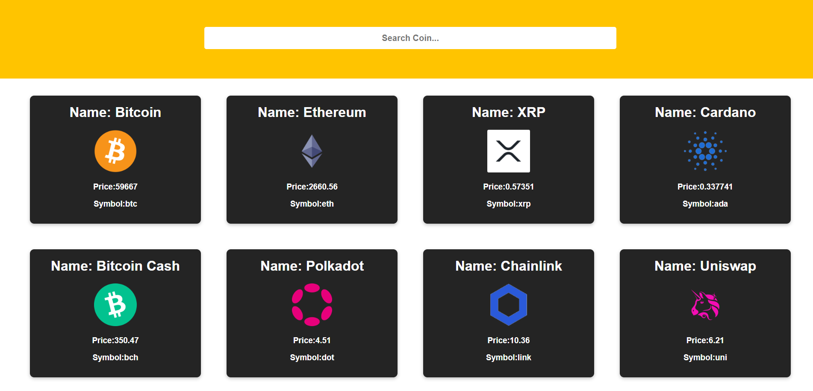
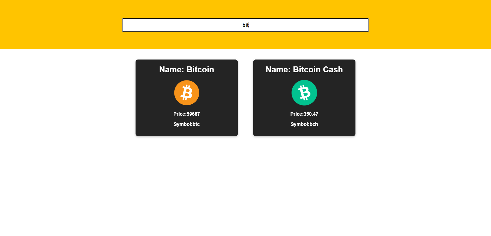

# React Crypto Coins

## About the Project

The cryptocurrency app instantly retrieves the data of cryptocurrencies using the API. You can see the name, symbol and current price of cryptocurrencies and search for the cryptocurrency you want.

## Screenshots





## Packages Used

The following packages were used during application development.

`React`

`Axios`

## Begin

To run the project, you need to install the following packages.

`npm`

```bash
  npm install npm@latest -g
```

## Setup

1. Clone Github repo

```bash
  git clone https://github.com/furkanhdemir/React-Crypto-Coins
```

2. Install NPM packages

```bash
  npm install
```

3 Run the crypto-app (inside the crypto-app folder)

```bash
  npm start
```

## Contact

Furkan Demir

[LinkedIn](https://www.linkedin.com/in/furkan-demir-a22844194/)

[furkanhd22@gmail.com](mailto:furkanhd22@gmail.com)

Project Link: https://github.com/furkanhdemir/React-E-Commerce-
